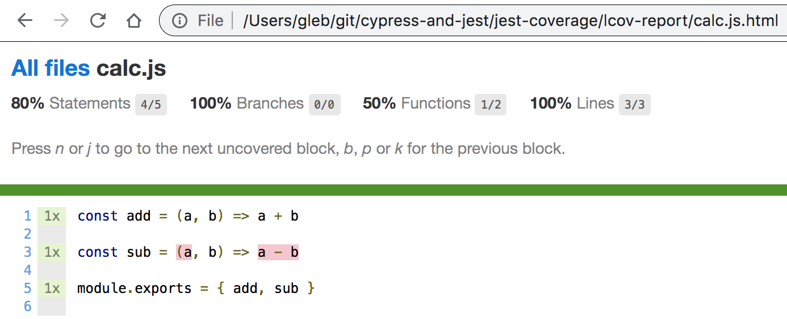

# cypress-and-jest
> Cypress and Jest both with code coverage running unit tests

The source code is in the folder [src](src). There is really just a single file [src/calc.js](src/calc.js). Let's cover this file with unit tests by using two test runners: [Jest](https://jestjs.io/) and [Cypress](https://www.cypress.io).

## Jest tests

The Jest was initialized using `npx jest --init` command likes this:


In the generated [jest.config.js](jest.config.js) enable code coverage collection, and output into folder `jest-coverage` (to avoid clashing with Cypress coverage report).

```js
// jest.config.js
module.exports = {
  // Indicates whether the coverage information should be collected while executing the test
  collectCoverage: true,
  // The directory where Jest should output its coverage files
  coverageDirectory: 'jest-coverage',
  // The test environment that will be used for testing
  testEnvironment: 'node'
}
```

The Jest test is in [__tests__/calc.test.js](__tests__/calc.test.js) and only runs the `add` function. We can run the Jest tests and see the coverage summary.


The coverage reports in `jest-coverage` folder by default include LCOV and static HTML. The HTML report shows that the inside of the function `sub` was not reached by the Jest tests.



## Cypress

Initialize Cypress with `npx @bahmutov/cly init` command.


In [cypress/integration/spec.js](cypress/integration/spec.js) let's require `sub` function and test it

```js
// cypress/integration/spec.js
const { sub } = require('../../src/calc')
it('subtracts 10 - 5', () => {
  expect(sub(10, 5)).to.equal(5)
})
```

The test passes


